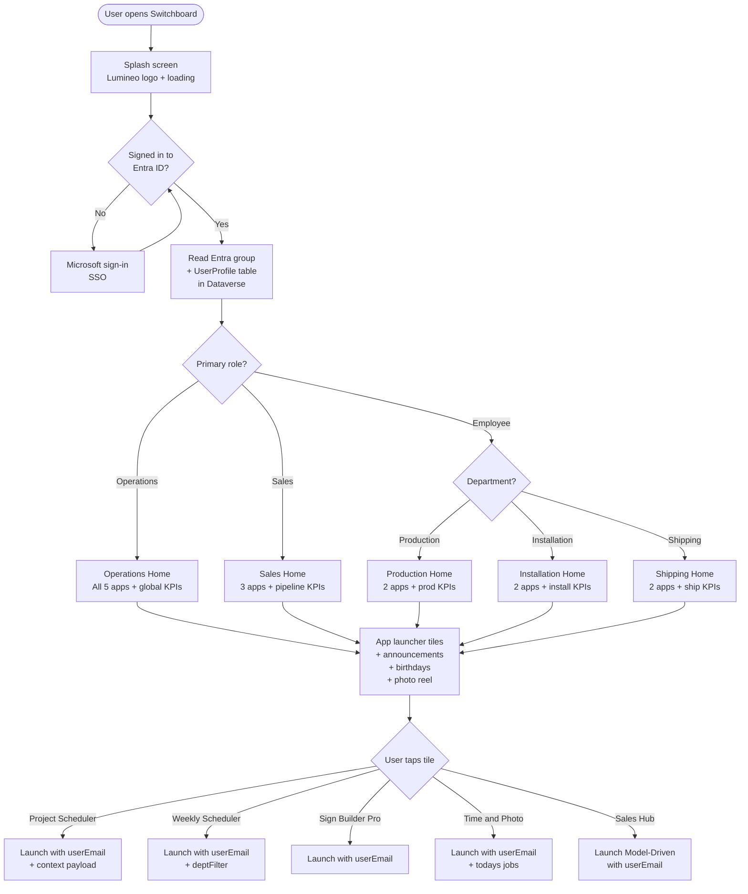
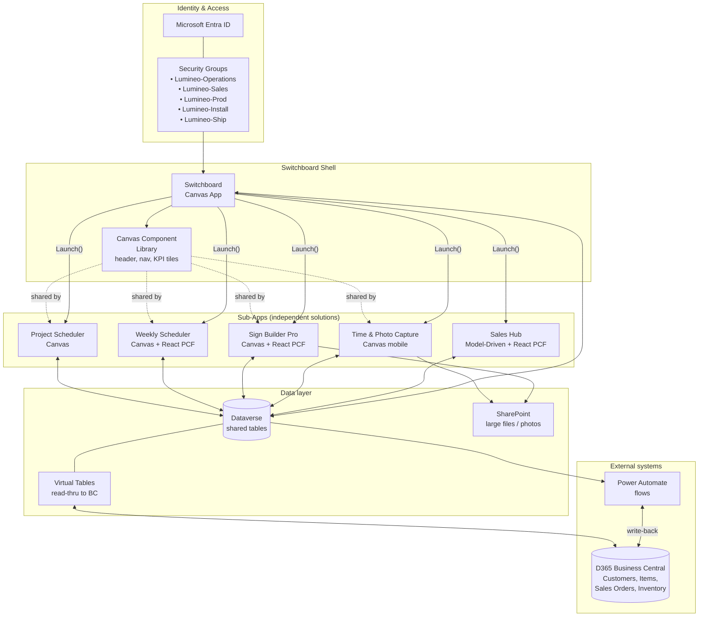
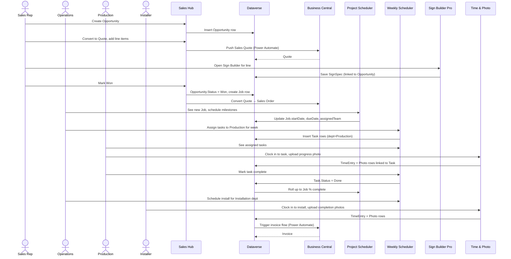

# 02 — Flowcharts

Three views: **user journey**, **system architecture**, and **data flow**. All in Mermaid so they render natively in GitHub.

## A. User journey — from launch to sub-app

## B. System architecture

## C. Data flow — a job from quote to install

This shows how a single record lives across the apps and across Dataverse ↔ Business Central.

